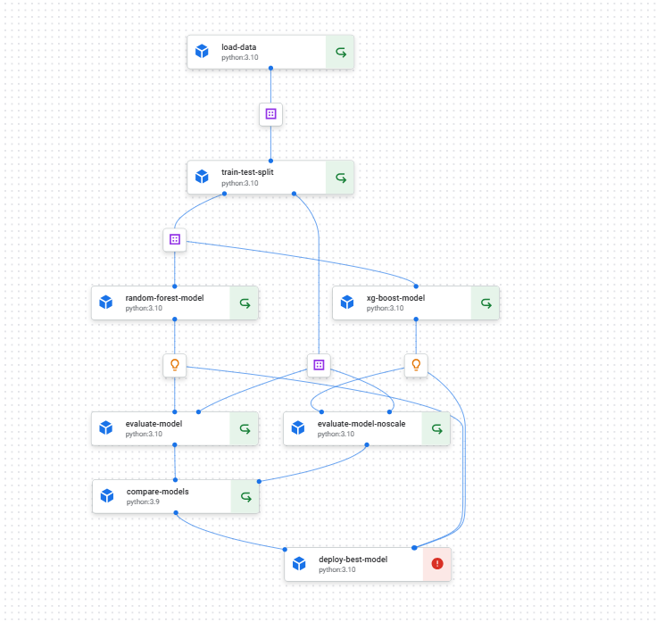

# MLOPS in GCP 
## Description

 - In this repository, end to end pipeline is created for the machine learning using kubeflow and deployed in GCP with help of Vertex ai other functionality like model registry and endpoint is tested
## How the pipeline looks in Vertex AI 

   
   
## How the endpoint working in Vertex UI 
        

## Future Works to incorporate 
    Monitoring and Drift detection 
    Scalable with Flask API for enterprise use on real use case
    Add Test case to check and ensure the flow is working fine 
         Unit tests for pipelines using pytest
         Model validation checks (e.g., no NaNs, shape consistency, schema check)
    Machine learning side 
         Hyperparamter tuning and use mlfow to trac and versioning 
         Fairness, Explainability & Interpretability
            SHAP / LIME for model explanations
            Bias detection (feature parity, demographic parity)
            Feature attribution reports in MLflow
    
